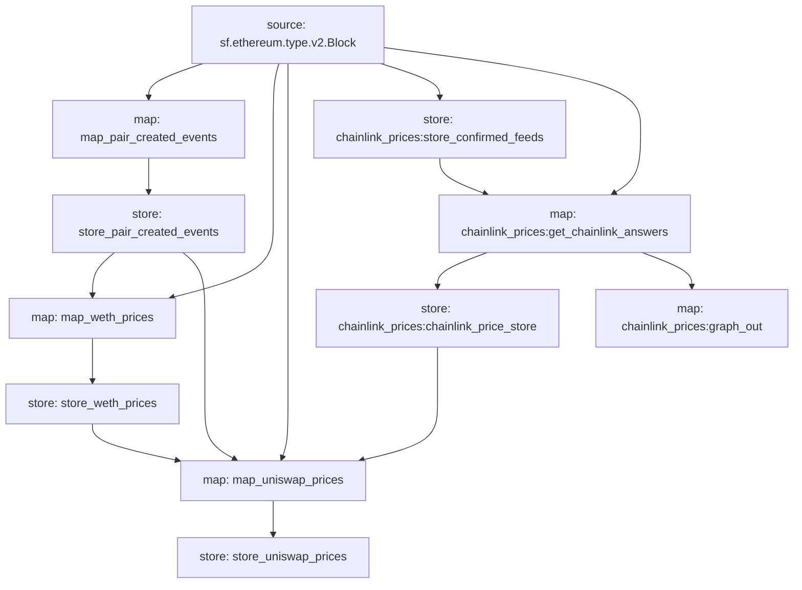

# Uniswap V2 USD Pricing Substream

## Overview
This Substream project tracks USD pricing for ERC20 tokens that exist in a Uniswap V2 pair. It does this by extracting `PairCreated` events from the Uniswap V2 Registry contract and calculates USD pricing for the involved tokens.

## Key Features
- **Pair Tracking**: Extracts `PairCreated` events from Uniswap V2 to identify token pairs.
- **Pricing Calculation**: Determines USD pricing for tokens in a pair, focusing on pairs containing WETH or known stablecoins.
- **ETH Price Handling**: Utilises a dedicated module to fetch the current ETH price from Uniswap V2. This is necessary for pairs involving ETH, as Chainlink price feeds are not available for the entire historical range of Uniswap V2.
- **Chainlink Prices Substream Integration**: For recent blocks where Chainlink data is available, the USD value retrieved from there is used.

## Dependencies
- `chainlink_prices` Substream package: Used for fetching ETH prices from Chainlink price feeds. https://github.com/Graph-BuildersDAO/substreams/tree/master/chainlink-prices

## Usage
To use the pricing data provided by this Substream:
1. Refer to the output types in the relevant store modules to understand the data format.
2. Use the key formats defined in `store_key_manager.rs` to access specific data points from the stores.

### Example
Here's a basic example of how to fetch the USD price of an ERC20 token (GRT):

```rust
// Use the appropriate store key to fetch the USD price by token symbol
// (See `store_key_manager.rs`)

let key = "UsdPriceByTokenSymbol:GRT";
let data = store.get_last(key);

// Now, you can access the Erc20Price data for this token
```

## Data Flow

